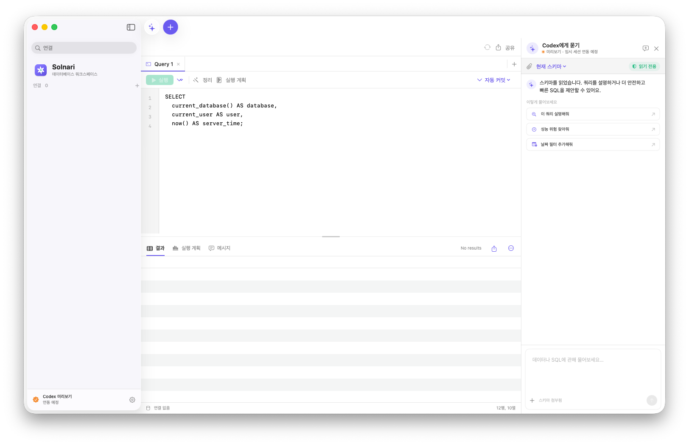

<p align="right"><a href="README.md">한국어</a></p>

<p align="center">
  
</p>

<h1 align="center">Solnari</h1>

<p align="center"><strong>A native, open-source macOS database tool that I am building for daily use.</strong></p>

<p align="center">
  <a href="https://github.com/dreamyoungs/solnari/actions/workflows/ci.yml"></a>
  <a href="https://support.apple.com/macos"></a>
  <a href="Package.swift"></a>
  <a href="LICENSE"></a>
</p>

<p align="center">
  
</p>

> [!NOTE]
> The current version is a **0.1.0 source preview**. Development builds work from source, but no
> official Developer ID-signed and notarized binary is available yet.

Solnari began when my one-year DataGrip subscription ended and I needed a database tool I could
keep using myself. Building it made me appreciate how much depth and polish established database
tools contain. The project is therefore growing beyond a quick replacement into an open-source
database workspace that feels at home on macOS and is built to last.

It starts with comfortable local database work, while treating private Cloud SQL, SSH, and
Kubernetes connections—and the execution boundary between humans and agents—as first-class design
problems.

> [!IMPORTANT]
> Solnari is under active early development. This document separates what works today from the
> direction being implemented. It does not claim full DataGrip feature parity or a finished
> organization policy engine.

## Why Solnari exists

The first goal was straightforward: retain the everyday workflow of writing queries, exploring
tables, and copying results in useful formats after an existing tool subscription ended. Working
through connection paths, result types, time zones, character sets, and tunnel lifecycles revealed
how deep a dependable database tool needs to be.

Solnari now aims to be:

- useful for real, everyday database work;
- explicit about how it reaches local, cloud, and private databases;
- careful with credentials and session lifecycles; and
- human-controlled when an agent proposes SQL.

## Available today

- Live PostgreSQL, MySQL, and SQLite connection testing and sessions
- Schema, table, and view discovery with dynamic query execution
- Table and view metadata for columns, defaults, nullability, charset/collation, comments, indexes,
  and constraints
- Safely quoted `SELECT` generation, read-only data opening, and qualified-name copying
- Direct TCP, Google's official Cloud SQL Connector, SSH tunnel, and existing-resource or relay Kubernetes paths
- ADC-based Cloud SQL automatic IAM authentication, engine-aware user suggestions, and project discovery
- Saved-connection editing and reconnecting, with confirmation before deletion
- Local connection definitions and a user-only AES-GCM credential vault
- Multi-tab SQL editor and resizable editor/result layout
- AppKit result grid with drag resizing, divider double-click fitting, and multi-row selection
- Copy and export to CSV, TSV, JSON, JSON Lines, Markdown, and SQL `INSERT`
- Character-set and collation configuration UI
- Display time zones that preserve zoned and zone-less timestamp semantics
- Runtime Korean/English switching and native light/dark appearance
- Single-instance lifecycle with session cleanup on quit, screen lock, sleep, and user switching
- Conservative SQL preflight and database-session write protection for read-only profiles
- An opt-in local MCP server exposing selected-connection metadata, schema, and a read-only query tool to external Codex clients
- A Codex UI prototype with explicit proposal-to-editor handoff

### Connection matrix

| Database | Direct | Cloud SQL | SSH | Kubernetes |
| --- | --- | --- | --- | --- |
| PostgreSQL | Available | Available | Available | Existing resource · relay |
| MySQL | Available | Available | Available | Existing resource · relay |
| SQLite | File | Not applicable | Not applicable | Not applicable |

Kubernetes prefers a pre-existing Service or Pod using minimum `pods/portforward` access. The
temporary relay is an explicitly selected experimental mode and additionally requires Pod lifecycle
permissions.

## Product direction

Solnari will preserve general-purpose database usability while allowing organizations to enforce
approved targets and execution policies when required.

1. **Explicit private connectivity** without silent public or direct fallback.
2. **Short-lived sessions** whose tunnels, connections, and temporary credentials are cleaned up.
3. **Inspectable organization policy** that separates transport, security posture, and DB access.
4. **Human-controlled agent execution** where proposals never become automatic SQL execution.
5. **A privacy-preserving desktop workflow** that does not log or telemeter credentials, SQL,
   schema, results, or agent conversations.

See the [backend architecture](docs/backend-architecture.md),
[connection paths](docs/connection-paths.md),
[external-agent MCP access](docs/mcp-access.ko.md),
[security-first connection architecture](docs/security-first-connection-architecture.ko.md), and
[threat model](docs/threat-model.ko.md).

### Architecture at a glance

```text
SwiftUI workspace
  ├─ Direct / SSH / Kubernetes / SQLite → native Swift adapters
  └─ Cloud SQL → private stdio JSON-RPC → bundled Node 24 Core
                                      ├─ Google Auth Library
                                      ├─ Cloud SQL Connector
                                      └─ pg / mysql2

Local Codex → bundled Node MCP STDIO server → user-only local socket → SwiftUI workspace
```

The Node Core runs with a sanitized environment, an isolated Application Support working directory,
and every `node:child_process` API disabled. External Codex MCP access is off by default, limited to
the selected connection, and never returns credentials, hosts, or cloud project identifiers. Tests
also enforce that Cloud SQL cannot silently fall back to `gcloud` or an external proxy.

## In progress

- Versioned and eventually signed organization policy profiles
- Idle/max session lifetime and orphan recovery after forced termination
- A dialect-aware SQL parser, consistent timeouts, query cancellation, and result/export limits
- Production write approval and one-time write capabilities
- In-app Codex App Server integration
- MCP write capabilities with one-time human approval
- Developer ID signing, notarization, and GitHub Release automation
- Table data editing and broader object exploration

## Build and run

Requirements: macOS 14 or newer, a Swift 6.1-compatible toolchain, and the Node.js 24 LTS version
pinned in `.node-version` with npm for source builds. The built app bundles its Node runtime.
If Xcode or Command Line Tools is missing, the build script prints the installation command. Install
the standalone Command Line Tools with `xcode-select --install`.

The bundled Node backend uses Google's official Auth Library and Cloud SQL Connector for discovery,
IAM authentication, and Cloud SQL sessions. Solnari never executes `gcloud` or an external
`cloud-sql-proxy`. The current SSH and Kubernetes paths still require OpenSSH and `kubectl`.

| Feature | Additional local setup |
| --- | --- |
| Direct / SQLite | None |
| Cloud SQL IAM | Application Default Credentials and the required Cloud SQL IAM permissions |
| SSH tunnel | macOS OpenSSH configuration or an SSH agent |
| Kubernetes | `kubectl`, kubeconfig, and port-forward access to the selected resource |

```bash
git clone https://github.com/dreamyoungs/solnari.git
cd solnari
nvm use # when using nvm
npm --prefix backend ci --include=dev
./Scripts/run-app.sh
```

Build a local Release configuration app:

```bash
npm --prefix backend ci --include=dev
./Scripts/build-app.sh release
```

On the first app bundle build, the script downloads the official Node.js license matching
`.node-version`, verifies its checksum, and caches it under `.build`. It does not depend on a license
file in the local Node installation directory.

`run-app.sh` installs the development bundle at `~/Applications/Solnari Development.app` before
launching it, avoiding macOS Documents-folder access prompts caused by running a bundle inside a
repository. The bundle uses the [Solnari flower icon](Sources/Solnari/Resources/SolnariIcon.png) and
a certificate-free local development signature. Public releases will require Developer ID signing
and Apple notarization.

### Connect an external Codex client

Enable local MCP under `Settings → MCP access`, then run the displayed Codex registration command
once and restart Codex. The tools expose sanitized metadata and schema for the connection currently
selected in Solnari. Query execution is available only when that profile is already connected and
configured as `Read-only`. MCP is off on a new installation. See
[external-agent MCP access](docs/mcp-access.ko.md) for its security boundary and limitations.

## Verify

```bash
swift format lint --recursive --strict Sources Tests
swift test
npm --prefix backend run typecheck
npm --prefix backend test
npm --prefix backend audit --audit-level=low
./Scripts/build-app.sh release
git diff --check
```

Live PostgreSQL and MySQL tests run only when their test-server environment variables are present.
SQLite and isolated fake-CLI transport tests run by default.

## Security and privacy

Connection definitions stay in local app storage. Database passwords use a local AES-GCM vault with
a separate 256-bit key and user-only directory/file permissions. Automatic unlock keeps that key in
the same macOS user domain, so this protects against plaintext and accidental disclosure but not a
malicious process already running as the same user. Automatic IAM authentication neither requests
a database password nor passes one to helper arguments. Helper commands use executable and argument
arrays, and private connection failures never trigger an automatic transport fallback.
Solnari does not persist or telemeter SQL, schema, results, or agent conversations. When MCP is
enabled and a tool is called, the requested schema, query, and result can enter the selected external
agent's context.

See [SECURITY.md](SECURITY.md) for current limitations and private vulnerability reporting. Never
put credentials, private endpoints, production SQL, or customer data in a public issue.

Maintainers should follow the
[public release checklist](docs/public-release-checklist.ko.md) before distributing a binary.

## Contributing

Bug fixes, database-specific verification, UX proposals, and security reviews are welcome. Read
[CONTRIBUTING.md](CONTRIBUTING.md) before preparing a change.
[CODE_OF_CONDUCT.md](CODE_OF_CONDUCT.md) applies to issues, pull requests, and project community
spaces.

## License

Solnari is available under the [Apache License 2.0](LICENSE).
