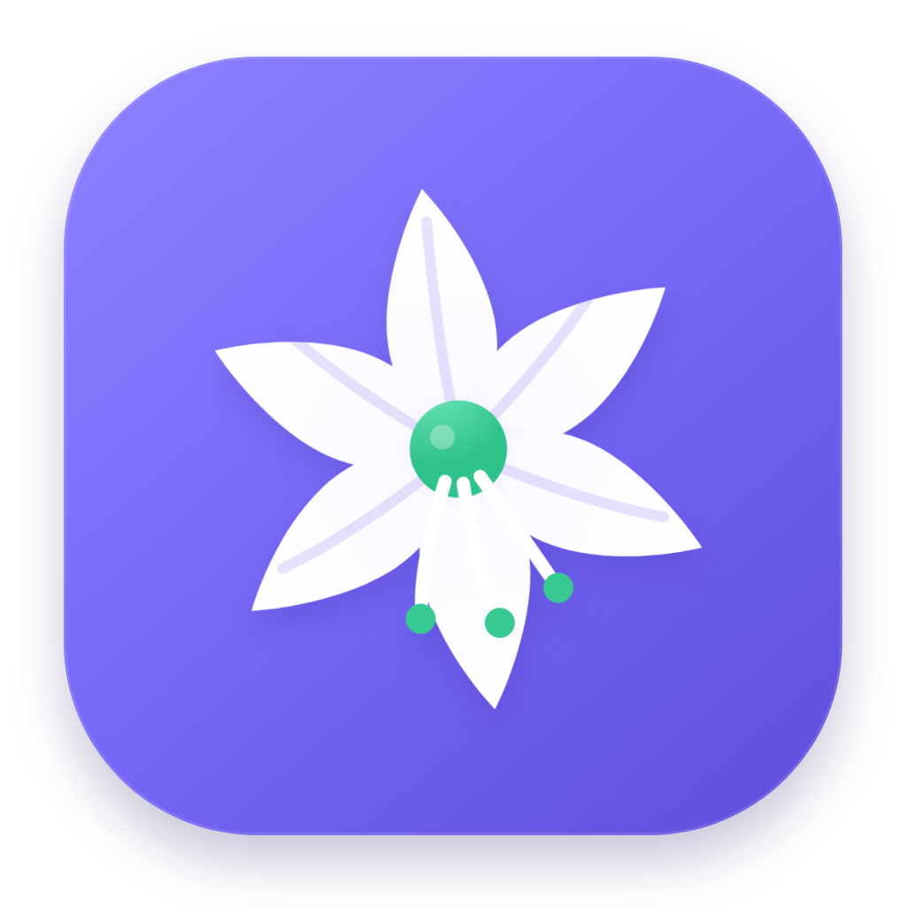
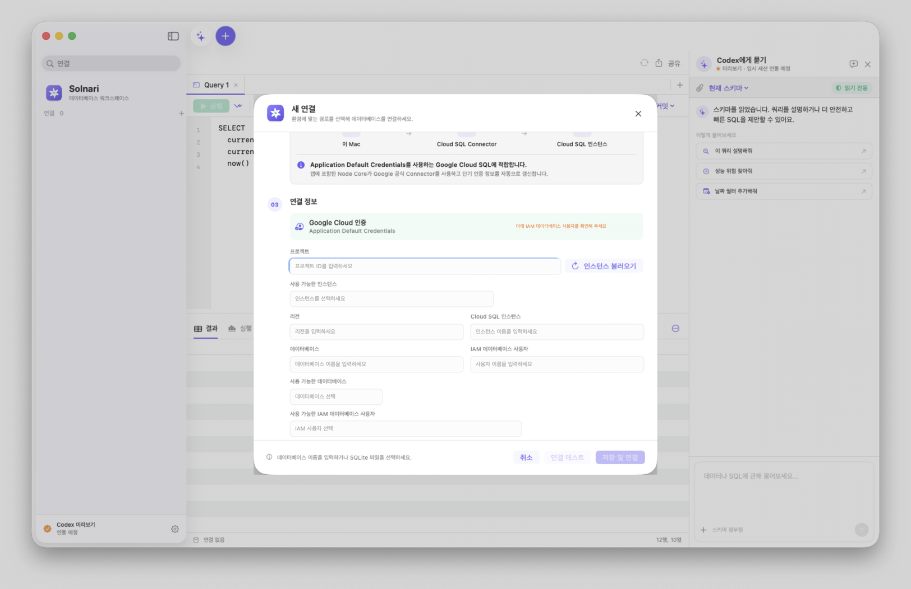

<p align="right"><a href="README.en.md">English</a></p>

<p align="center">
  
</p>

<h1 align="center">Solnari · 솔나리</h1>

<p align="center"><strong>내가 매일 사용할 수 있도록 만들고 있는 macOS 네이티브 오픈소스 데이터베이스 도구입니다.</strong></p>

<p align="center">
  <a href="https://github.com/dreamyoungs/solnari/actions/workflows/ci.yml"></a>
  <a href="https://support.apple.com/macos"></a>
  <a href="Package.swift"></a>
  <a href="LICENSE"></a>
</p>

<p align="center">
  
</p>

> [!NOTE]
> 현재 버전은 **0.2.0 Apple Silicon preview**입니다. [GitHub Releases에서 unsigned DMG를
> 받을 수 있습니다](https://github.com/dreamyoungs/solnari/releases/tag/v0.2.0). Apple
> Developer Program 가입 전까지는 Developer ID 서명·notarization되지 않으므로 최초 실행 시
> 아래의 macOS 보안 승인 절차가 필요합니다.

솔나리는 DataGrip 1년 약정이 끝난 뒤, 개인적으로 계속 사용할 데이터베이스 도구가
필요해서 시작한 프로젝트입니다. 직접 만들기 시작하고 나서야 기존 제품의 완성도가 왜
높은지 더 잘 알게 되었고, 단순한 복제품이 아니라 macOS에 자연스럽고 오래 사용할 수
있는 오픈소스 데이터베이스 workspace로 발전시키고 있습니다.

로컬 데이터베이스를 편하게 다루는 것부터 시작하지만, Cloud SQL·SSH·Kubernetes 같은
private 연결 경로와 사람·Agent 사이의 실행 경계를 명확하게 만드는 것도 솔나리의 중요한
설계 방향입니다.

> [!IMPORTANT]
> 솔나리는 현재 활발히 개발 중인 초기 버전입니다. 아래의 **현재 지원**과 **구현 중인
> 방향**을 구분해서 확인해 주세요. 아직 보안 정책 엔진이나 DataGrip 수준의 전체 기능을
> 제공한다고 주장하지 않습니다.

## 왜 만들었나요?

처음에는 익숙하게 사용하던 DB 도구의 구독이 끝난 것이 계기였습니다. 쿼리를 작성하고,
테이블을 살펴보고, 결과를 여러 형식으로 복사하는 일상적인 흐름을 제 Mac에 맞게 직접
만들어 보고 싶었습니다.

연결 방식과 결과 타입, 시간대, 문자셋, 터널 수명주기까지 하나씩 구현하면서 DB 도구가
생각보다 훨씬 깊은 제품이라는 점을 체감했습니다. 그래서 솔나리의 목표도 "기능을 빠르게
흉내 내는 대체품"에서 다음과 같은 제품으로 바뀌었습니다.

- 일상적인 DB 작업에 실제로 사용할 수 있는 도구
- 로컬·클라우드·private database 연결 과정을 숨기지 않는 도구
- 비밀정보와 세션 수명주기를 신중하게 다루는 도구
- Agent가 SQL을 제안하더라도 실행 결정은 사람에게 남기는 도구

## 현재 지원

- PostgreSQL, MySQL, SQLite 연결 테스트와 실제 세션 연결
- 사용자 스키마·테이블·뷰 탐색과 동적 쿼리 실행
- 테이블·뷰의 컬럼, 기본값, NULL 여부, 문자셋·정렬 규칙, 주석, 인덱스와 제약조건 보기
- 안전하게 인용한 식별자로 `SELECT` 생성, 읽기 전용 데이터 열기와 정규화된 이름 복사
- Direct TCP, Google 공식 Cloud SQL Connector, SSH tunnel, Kubernetes 기존 리소스·임시 relay 경로
- ADC 기반 Cloud SQL 자동 IAM 인증, 엔진별 IAM DB 사용자명 제안, 프로젝트 리소스 조회
- 저장된 연결의 편집·재연결과 확인 절차가 있는 삭제
- 로컬 연결 정의와 AES-GCM으로 암호화한 사용자 전용 credential vault
- 다중 탭 SQL editor와 크기 조절 가능한 editor/result layout
- 드래그·경계선 더블클릭 컬럼 맞춤과 다중 행 선택을 지원하는 AppKit 기반 결과 grid
- CSV, TSV, JSON, JSON Lines, Markdown, SQL `INSERT` 복사·내보내기
- PostgreSQL/MySQL/SQLite의 문자셋·정렬 규칙 설정 UI
- 절대 시간과 시간대 없는 값을 구분하는 결과 시간대 표시
- 한국어·영어 런타임 전환과 macOS light/dark appearance
- 앱 중복 실행 방지와 종료·잠금·절전·사용자 전환 시 연결 세션 정리
- 읽기 전용 profile의 보수적인 SQL 사전 검사와 DB session 쓰기 차단
- 현재 선택한 연결의 metadata·schema와 읽기 전용 query tool을 외부 Codex에 제공하는 opt-in local MCP server
- Agent 제안 SQL을 editor로 명시적으로 넘기는 Codex UI prototype

### 연결 지원표

| 데이터베이스 | Direct | Cloud SQL | SSH | Kubernetes |
| --- | --- | --- | --- | --- |
| PostgreSQL | 지원 | 지원 | 지원 | 기존 리소스 · 임시 relay |
| MySQL | 지원 | 지원 | 지원 | 기존 리소스 · 임시 relay |
| SQLite | 파일 연결 | 해당 없음 | 해당 없음 | 해당 없음 |

Kubernetes는 기존 Service/Pod에 `pods/portforward` 최소 권한으로 연결하는 경로를
우선 제공합니다. 임시 relay는 명시적으로 선택하는 실험 기능이며, 이 경우에만 세션용
Pod 생성·삭제 권한이 추가로 필요합니다.

## 솔나리가 지향하는 방향

솔나리는 범용 DB 사용성을 유지하면서, 필요한 조직에서는 승인된 연결 대상과 실행
정책을 강제할 수 있는 구조를 지향합니다.

1. **명시적인 private 연결**
   어떤 project, cluster, namespace, proxy와 database를 거치는지 사용자가 확인할 수
   있어야 하며, private 경로가 실패했을 때 public/direct 경로로 자동 전환하지 않습니다.
2. **짧게 존재하는 안전한 세션**
   tunnel, database connection과 단기 credential은 앱 종료·화면 잠금·절전·timeout에
   맞춰 정리되어야 합니다.
3. **조직이 검증할 수 있는 정책**
   연결 방법, 보안 정책과 DB 접근 등급을 분리하고, 조직 profile이 대상과 허용 범위를
   읽기 전용으로 고정할 수 있도록 설계합니다.
4. **사람이 통제하는 Agent 실행**
   Agent는 SQL을 설명하고 제안할 수 있지만 자동 실행하지 않습니다. 최종 SQL과 대상,
   예상 영향을 사람이 확인하고 명시적으로 승인해야 합니다.
5. **데이터를 수집하지 않는 desktop workflow**
   credential, SQL, schema, query result와 Agent 대화를 application log나 telemetry에
   기록하지 않습니다.

자세한 현재 구조와 보안 목표는 [Backend architecture](docs/backend-architecture.md),
[Connection paths](docs/connection-paths.md),
[외부 Agent용 MCP 접근](docs/mcp-access.ko.md),
[보안 우선 연결 아키텍처](docs/security-first-connection-architecture.ko.md),
[위협 모델](docs/threat-model.ko.md)을 참고해 주세요.

### 아키텍처 한눈에 보기

```text
SwiftUI workspace
  ├─ Direct / SSH / Kubernetes / SQLite → native Swift adapters
  └─ Cloud SQL → private stdio JSON-RPC → bundled Node 24 Core
                                      ├─ Google Auth Library
                                      ├─ Cloud SQL Connector
                                      └─ pg / mysql2

Local Codex → bundled Node MCP STDIO server → user-only local socket → SwiftUI workspace
```

Node Core는 정제된 환경과 전용 Application Support 작업 디렉터리에서 실행되며 모든
`node:child_process` API를 차단합니다. 외부 Codex용 MCP는 기본적으로 꺼져 있고 현재 선택한
연결만 보며, credential·host·Cloud project 식별자를 반환하지 않습니다. Cloud SQL 경로가
`gcloud`나 외부 Proxy로 자동 우회하지 않도록 이 경계를 테스트합니다.

## 아직 구현 중입니다

- 조직 관리형 policy profile과 서명·무결성 검증
- 연결 idle/max lifetime, 강제 종료 뒤 orphan process 복구
- dialect-aware SQL parser, 공통 timeout, query cancel과 결과/export 상한
- 운영 DML/DDL 승인과 일회성 write capability
- 실제 앱 내부 Codex App Server 연동
- MCP write capability와 사람의 일회성 승인 workflow
- GitHub Release 자동 배포와 Intel Mac build
- 테이블 데이터 수정과 더 넓은 DB 객체 탐색

진행 중인 항목을 현재 보장처럼 표시하지 않는 것을 프로젝트 문서 원칙으로 삼습니다.

## 설치

### Apple Silicon용 DMG로 설치하기

[Solnari 0.2.0 Release](https://github.com/dreamyoungs/solnari/releases/tag/v0.2.0)에서
`Solnari-0.2.0-macos-arm64-unsigned.dmg`를 내려받습니다. 현재 DMG는 Apple Developer
Program에 가입하지 않고 만든 무료 오픈소스 preview라서 ad-hoc 서명되어 있고 Apple의
notarization을 받지 않았습니다. Apple Silicon Mac에서 다음 순서로 최초 실행을 승인합니다.

1. DMG를 열고 `Solnari.app`을 **응용 프로그램** 폴더로 복사합니다.
2. 응용 프로그램 폴더의 Solnari를 한 번 실행하고 macOS 경고창에서 **완료**를 누릅니다.
3. **시스템 설정 → 개인정보 보호 및 보안**을 열고 화면 맨 아래 **보안** 영역까지
   스크롤합니다.
4. “Mac을 보호하기 위해 ‘Solnari’을(를) 차단했습니다” 옆의 **그래도 열기**를 누릅니다.
5. 암호 또는 Touch ID로 승인한 뒤 다시 나타나는 창에서 **그래도 열기**를 선택합니다.

이 승인은 해당 앱에 한 번만 필요합니다. **그래도 열기** 항목은 실행을 시도한 뒤 약 한 시간
동안 표시됩니다. 자세한 배경과 Apple의 공식 절차는
[Apple의 보안 설정을 재정의하여 앱 열기](https://support.apple.com/guide/mac-help/mh40617/mac)를
참고해 주세요.

보안 예외를 승인하고 싶지 않거나 배포 파일 대신 전체 build 과정을 직접 확인하고 싶다면
아래의 **소스에서 직접 빌드하기**를 이용할 수 있습니다. 프로젝트 사용과 GitHub Stars가
충분히 늘어나면 Apple Developer Program에 등록하고 Developer ID로 서명·notarization한
DMG를 제공할 계획입니다.

### 요구사항

- macOS 14 이상
- Apple Silicon Mac(공개 DMG 기준, Intel Mac은 아직 지원하지 않음)
- Swift 6.1 이상 또는 호환되는 Xcode toolchain
- `.node-version`에 명시한 Node.js 24 LTS와 npm(소스 build에만 필요하며 완성된 app에는
  runtime을 포함합니다)

Xcode 또는 Command Line Tools가 없다면 build script가 설치 명령을 안내합니다. standalone
Command Line Tools는 `xcode-select --install`로 설치할 수 있습니다.

Cloud SQL 연결과 리소스 조회는 app에 포함된 Node backend가 Google 공식 Auth Library와
Cloud SQL Connector로 처리합니다. Solnari는 `gcloud` 또는 외부 `cloud-sql-proxy`를 실행하지
않습니다. 현재 SSH와 Kubernetes 경로에는 각각 OpenSSH와 `kubectl`이 필요합니다.

| 기능 | 추가로 필요한 로컬 구성 |
| --- | --- |
| Direct / SQLite | 없음 |
| Cloud SQL IAM | Application Default Credentials와 필요한 Cloud SQL IAM 권한 |
| SSH tunnel | macOS OpenSSH 설정 또는 SSH agent |
| Kubernetes | `kubectl`, kubeconfig와 대상 리소스의 port-forward 권한 |

### 소스에서 직접 빌드하기

```bash
git clone https://github.com/dreamyoungs/solnari.git
cd solnari
nvm use # nvm을 사용한다면
npm --prefix backend ci --include=dev
./Scripts/run-app.sh
```

Release 설정으로 로컬 앱을 빌드하고 `~/Applications/Solnari Development.app`에 복사한 뒤
실행하려면 다음을 사용합니다.

```bash
npm --prefix backend ci --include=dev
./Scripts/run-app.sh release
```

실행·복사 없이 app bundle만 만들려면 `./Scripts/build-app.sh release`를 사용합니다. 결과는
`.build/app/release/Solnari.app`에 생성됩니다.

최초 app bundle build에서는 `.node-version`과 일치하는 공식 Node.js license를 내려받아
checksum을 검증한 뒤 `.build` cache에 보관합니다. 로컬 Node 설치 directory의 license file에는
의존하지 않습니다.

### 버전 올리기

`VERSION`은 사용자에게 표시되는 `x.y.z`, `BUILD_NUMBER`는 개별 app build 번호입니다.
버그·작은 수정은 `patch`, 기능 추가는 `minor`, 안정판의 호환성 변경은 `major`를 사용합니다.

```bash
./Scripts/bump-version.sh patch
./Scripts/bump-version.sh minor
./Scripts/bump-version.sh build # 앱 버전은 유지하고 build 번호만 증가
```

### 로컬 Apple Silicon DMG 만들기

Apple Developer Program 가입 없이 테스트용 DMG를 만들 수 있습니다.

```bash
./Scripts/package-local-dmg.sh
```

결과는 `.build/release/Solnari-0.2.0-macos-arm64-unsigned.dmg`와 SHA-256 파일입니다. 이 DMG는
GitHub Release의 preview와 동일하게 ad-hoc 서명 앱을 포함하며 notarization되지 않았습니다.

### 공식 Apple Silicon DMG 만들기

Apple Developer Program 가입 후 Developer ID Application 인증서와 `notarytool` Keychain
profile을 준비해 실행합니다.

```bash
export SOLNARI_CODESIGN_IDENTITY="Developer ID Application: Example (TEAMID)"
export SOLNARI_NOTARY_KEYCHAIN_PROFILE="solnari-notary"
./Scripts/package-release.sh
```

결과는 `.build/release/Solnari-0.2.0-macos-arm64.dmg`와 SHA-256 파일입니다. 앱과 DMG를
Developer ID로 서명하고 DMG를 notarization한 뒤 ticket을 staple합니다. 가입 전에는 이
script의 인증서·notary 사전 검사를 통과할 수 없습니다.

`run-app.sh`는 macOS의 Documents 폴더 접근 요청을 피하도록 빌드된 앱을
`~/Applications/Solnari Development.app`에 복사해서 실행합니다. 이 앱은
[솔나리 꽃 아이콘](Sources/Solnari/Resources/SolnariIcon.png)과 인증서 없는 로컬 개발용
서명을 사용합니다. `package-release.sh`로 만드는 공개 DMG에는 Developer ID 서명과 Apple
notarization을 적용합니다.

빠른 개발 반복에는 `swift run Solnari`도 사용할 수 있습니다. 최초 번들 실행 시 이전
`swift run`에서 만든 비민감 연결 목록·언어·표시 시간대 설정을 한 번 이관합니다.

### 외부 Codex에서 연결하기

앱의 `설정 → MCP 접근`에서 local MCP를 켜고 표시되는 Codex 등록 명령을 한 번 실행합니다.
그 뒤 Codex를 재시작하면 현재 Solnari에서 선택한 연결의 정제된 metadata·schema와 읽기 전용
query 도구를 사용할 수 있습니다. MCP는 새 설치에서 꺼져 있고, query는 이미 연결된
`Read-only` profile에만 허용됩니다. 자세한 범위와 제한은
[외부 Agent용 MCP 접근](docs/mcp-access.ko.md)을 확인해 주세요.

## 검증

```bash
swift format lint --recursive --strict Sources Tests
swift test
npm --prefix backend run typecheck
npm --prefix backend test
npm --prefix backend audit --audit-level=low
./Scripts/build-app.sh release
git diff --check
```

PostgreSQL과 MySQL의 live integration test는 테스트 서버 환경변수가 있을 때만 실행됩니다.
SQLite와 격리된 fake CLI transport test는 기본 `swift test`에서 실행됩니다. 자세한 설정은
[Backend architecture](docs/backend-architecture.md)를 참고해 주세요.

## 개인정보와 보안

- 연결 정의는 이 Mac의 로컬 app storage에, 일반 DB 비밀번호는 별도 256-bit key를 사용하는
  AES-GCM credential vault에 저장합니다. directory와 파일은 현재 macOS 사용자만 읽도록
  각각 `0700`, `0600` 권한을 적용합니다.
- 자동 잠금 해제를 위해 암호화 key도 같은 사용자 영역에 보관하므로, 이 방식은 같은 사용자
  권한을 탈취한 악성 process에 대해 macOS Keychain과 같은 보호를 제공하지 않습니다.
- 자동 IAM 인증에서는 DB 비밀번호를 요청하거나 helper argument로 전달하지 않습니다.
- helper command는 shell 문자열이 아닌 executable과 argument 배열로 실행합니다.
- Solnari는 Codex 대화, SQL, schema와 result를 영속화하거나 telemetry로 보내지 않습니다.
  MCP를 켜고 도구를 호출하면 요청한 schema·query·result는 선택한 외부 Agent context로 전달될
  수 있습니다.
- private 연결 실패 시 다른 transport로 자동 fallback하지 않습니다.

현재 한계와 취약점 제보 방법은 [SECURITY.md](SECURITY.md)를 확인해 주세요. 실제 endpoint,
credential, 운영 SQL 또는 고객 데이터를 공개 issue에 첨부하지 마세요.

공식 바이너리를 만드는 유지관리 절차와 공개 전 확인 항목은
[공개·릴리스 체크리스트](docs/public-release-checklist.ko.md)를 따릅니다.

## 기여하기

작은 버그 수정, DB별 동작 검증, UX 제안과 보안 리뷰를 모두 환영합니다.
[CONTRIBUTING.md](CONTRIBUTING.md)의 개발 및 검증 절차를 먼저 확인해 주세요.
[행동 강령](CODE_OF_CONDUCT.md)은 issue, pull request와 프로젝트 커뮤니티 공간에 모두
적용됩니다.

## 라이선스

Solnari는 [Apache License 2.0](LICENSE)으로 공개됩니다.
