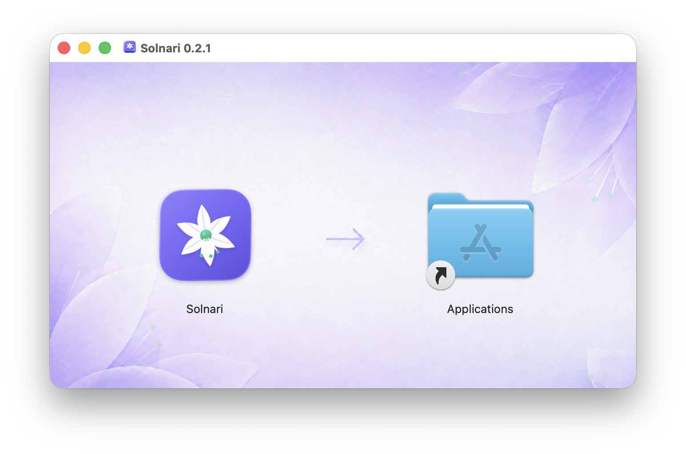
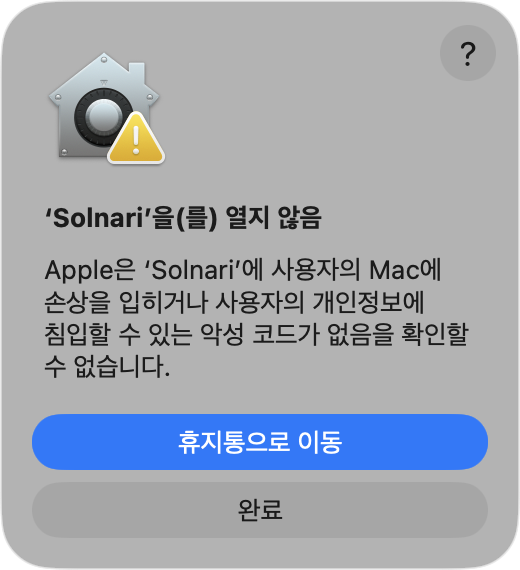
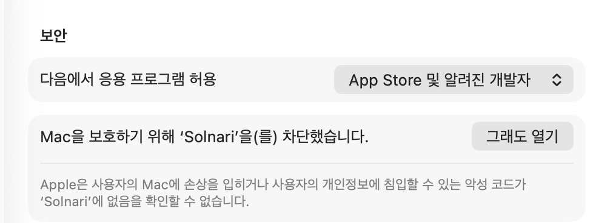
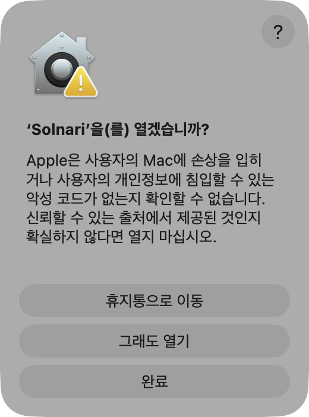

# unsigned Solnari를 macOS에서 처음 열기

현재 공개 preview DMG는 Apple Developer ID로 서명되거나 Apple의 notarization을 받지
않았습니다. 따라서 macOS는 Solnari가 악성 코드를 포함하지 않는지 확인할 수 없다는 경고를
표시합니다. 아래 절차는 이 경고를 끄거나 시스템 전체 보안을 낮추지 않고, 사용자가 확인한
Solnari 앱 하나만 예외로 등록합니다.

보안 예외 적용이 불편하다면 DMG를 실행하지 말고 저장소의 소스와 빌드 절차를 직접 검토해
빌드하세요. 다운로드는 반드시 [공식 Solnari 저장소의 Releases](https://github.com/dreamyoungs/solnari/releases)에서
받고, Release에 게시된 SHA-256 파일이 있다면 함께 확인하세요.

## 1. DMG에서 응용 프로그램으로 복사

DMG를 열고 **Solnari** 아이콘을 오른쪽의 **Applications** 폴더로 드래그합니다.



게시된 checksum을 명령줄에서 확인하려면 DMG와 `.sha256` 파일을 같은 폴더에 둔 뒤 다음을
실행할 수 있습니다. 출력에 `OK`가 표시되지 않으면 DMG를 열지 마세요.

```bash
shasum -a 256 -c Solnari-0.2.1-macos-arm64-unsigned.dmg.sha256
```

## 2. 최초 실행 경고 확인

응용 프로그램 폴더에서 Solnari를 한 번 실행합니다. 아래 경고가 나타나면 **완료**를
누릅니다. **휴지통으로 이동**은 앱을 삭제하므로 선택하지 않습니다.



이 경고는 현재 배포 파일이 서명·notarization되지 않았기 때문에 나타납니다. 앱 이름이나
다운로드 출처가 예상과 다르다면 다음 단계로 진행하지 마세요.

## 3. 개인정보 보호 및 보안에서 한 번만 허용

**시스템 설정 → 개인정보 보호 및 보안**을 열고 **보안**까지 아래로 스크롤합니다. “Mac을
보호하기 위해 ‘Solnari’을(를) 차단했습니다” 항목에서 **그래도 열기**를 누릅니다.



암호 또는 Touch ID로 인증합니다. 마지막 확인창에서 앱 이름이 **Solnari**인지 다시 확인한
뒤 **그래도 열기**를 선택합니다. macOS 버전에 따라 이 버튼이 **열기**로 표시될 수 있습니다.



승인한 앱은 이후 같은 Mac에서 일반 앱처럼 열 수 있습니다.
**그래도 열기** 항목은 최초 실행을 시도한 뒤 약 한 시간 동안만 표시됩니다.

시스템 전체 Gatekeeper를 끄는 터미널 명령이나 “모든 곳에서 받은 앱 허용” 설정은 사용하지
마세요. Apple도 보안 예외는 출처와 무결성을 확인한 앱에만 적용하도록 안내합니다.

## 확인 환경

- 캡처 및 절차 확인: macOS 26.6.2 (빌드 25G83), 2026-09-04
- Solnari 지원 범위: macOS 14 이상
- Apple 공식 안내: [Mac에서 앱을 안전하게 열기](https://support.apple.com/ko-kr/102445),
  [보안 설정을 재정의하여 앱 열기](https://support.apple.com/guide/mac-help/mh40617/mac)

macOS 버전과 표시 언어에 따라 버튼 문구나 위치가 조금 달라질 수 있습니다. 절차가 다르면
보안 설정을 임의로 낮추지 말고 위 Apple 공식 안내를 먼저 확인하세요.
